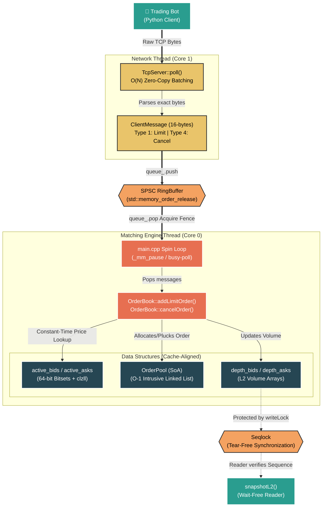

# NanoMatch: Low-Latency Networked Matching Engine

NanoMatch is a distributed, high-frequency trading (HFT) matching engine engineered in C++20. It serves as a comprehensive demonstration of full-stack low-latency engineering, spanning from raw TCP network socket framing down to hardware-level SIMD CPU instructions. 

The system acts as a central Limit Order Book (LOB) exchange. It is designed to receive streaming trade requests over a network, execute wait-free concurrent matching logic, and maintain exact $O(1)$ time complexities. The engine has been rigorously benchmarked to process **14 Million operations per second** with an average end-to-end latency of **~55 CPU cycles**, bypassing traditional OS and memory bottlenecks entirely.

---

## ⚙️ Tech Stack & Networking Concepts

Built from the ground up for extreme network throughput and systems-level determinism, this project utilizes the following technologies and architectural concepts:

### Tools & Frameworks
*   **Languages:** C++20 (Engine & Network Server), Python 3 (Algorithmic Trading Bot).
*   **Build & Testing:** CMake, MSYS2/MinGW GCC 16.1, Google Test (Adversarial Suite).
*   **Systems Tools:** Unix `sysctl`, Linux `grub` tuning, Windows Winsock2 / POSIX Sockets.

### Applied Networking & Systems Concepts (L4/L7)
*   **TCP/IP Socket Programming:** Engineered raw non-blocking TCP sockets to handle high-throughput algorithmic trading feeds.
*   **Zero-Copy TCP Framing:** Implemented $O(N)$ bulk-erasure logic to flawlessly parse fragmented and burst-bulked TCP byte streams without memory allocations.
*   **Layer 7 Protocol Optimization:** Designed a strict 16-byte binary application protocol using **C++ Anonymous Unions** to completely eliminate packet bloat (banning strings and floats).
*   **Nagle's Algorithm Bypass:** Enforced `TCP_NODELAY` to force immediate packet flushing across the wire.
*   **Wait-Free Inter-Process Communication (IPC):** Synchronized the Network Thread and the CPU Execution Thread using Lock-Free SPSC Ring Buffers and `std::memory_order` hardware fences.
*   **Unix Systems Determinism:** Leveraged CPU Core Isolation (`isolcpus`), network busy-polling (`net.core.busy_read`), and NUMA Thread Affinity (`pthread_setaffinity_np`) to eliminate OS context-switching jitter.

---

## 🏗 System Architecture



---

## 🎯 Skills & Engineering Competencies Demonstrated

This project serves as a comprehensive portfolio piece demonstrating practical, production-level experience in several core engineering domains:

*   **Networking Fundamentals (TCP/IP):** Engineered a raw TCP socket server from scratch to handle raw byte streams, implementing zero-copy message batching and protecting against network fragmentation boundaries.
*   **Unix Systems Administration:** Applied advanced Linux kernel tuning parameters for production HFT environments, including CPU isolation (`isolcpus`, `nohz_full`), `sysctl` network busy-polling (`net.core.busy_read`), and allocating HugePages to prevent TLB misses.
*   **High-Performance Coding (C++20):** Developed the entire matching engine in C++20 using bare-metal optimization techniques (SIMD intrinsic instructions, wait-free ring buffers, custom memory allocators, and hardware cache-line alignment).
*   **Scripting (Python & Shell):** Built an automated algorithmic market-maker client in Python to simulate high-load network traffic, alongside Shell/Bash configuration scripts for kernel modifications and CMake build orchestration.

---

## 📖 Core Concepts
1. [Introduction: What is an Order Book?](#1-introduction-what-is-an-order-book)
2. [Networking (Zero-Bloat Anonymous Unions)](#2-networking-zero-bloat-anonymous-unions)
3. [Wait-Free Concurrency (Seqlocks & Ring Buffers)](#3-wait-free-concurrency-seqlocks--ring-buffers)
4. [Thread Pinning (Fighting the OS)](#4-thread-pinning-fighting-the-os)
5. [Zero-Allocation (Why `new` is too slow)](#5-zero-allocation-why-new-is-too-slow)
6. [CPU Caching (OOP vs. Data-Oriented Design)](#6-cpu-caching-oop-vs-data-oriented-design)
7. [Fast Discovery (Bitmaps & Hardware Magic)](#7-fast-discovery-bitmaps--hardware-magic)
8. [Pure O(1) Cancellation (Intrusive Lists)](#8-pure-o1-cancellation-intrusive-lists)
9. [How to Build, Test & Run](#9-how-to-build-test--run)
10. [Linux Kernel Tuning (Production HFT)](#10-linux-kernel-tuning-production-hft)

---

## 1. Introduction: What is an Order Book?
Imagine you open an app like Robinhood and want to buy a share of Apple. Where does that order actually go? 
It goes to a central Exchange (like Nasdaq). The exchange keeps a massive ledger called a **Limit Order Book (LOB)**. It has two lists:
*   **Bids (Buyers):** People who want to buy, sorted by who is willing to pay the most.
*   **Asks (Sellers):** People who want to sell, sorted by who will sell for the cheapest.

When a buyer's price matches a seller's price, the exchange executes a trade! In the HFT world, we need to handle the network traffic and internal matching process in less than 1 microsecond. Let's see how we do it.

---

## 2. Networking (Zero-Bloat Anonymous Unions)

### The Problem
Computers are terrible at processing text strings (like `"AAPL"`) and floating-point decimals (`$103.50`). Decimals cause precision rounding errors, and strings require slow letter-by-letter comparison. Network packets also cost money in transmission time. We must make the incoming TCP `ClientMessage` strictly 16-bytes and absolutely no larger to prevent overflowing hardware cache lines.

### The Solution: C++ Anonymous Unions & Integers
*   **Prices:** We multiply all prices by 100. A price of `$103.50` is sent over the network as the whole integer `103500`.
*   **Tickers:** We don't send `"AAPL"`. We send the integer `0`. The server knows that `0` means Apple. 

```cpp
struct ClientMessage {
    uint8_t type; 
    uint16_t instrument_id; 
    uint32_t qty;       
    union {
        uint64_t price;     // Used for Add Order (Type 1)
        uint64_t order_id;  // Used for Cancel Order (Type 4)
    };
};
```
We use a packed struct with an **Anonymous Union**. This elegantly reuses the exact same 8-bytes in memory for both `price` and `order_id` depending on the packet type! This prevents the packet from bleeding over the 16-byte cache boundary while supporting vast new feature-sets over raw TCP sockets.

---

## 3. Wait-Free Concurrency (Seqlocks & Ring Buffers)

### The Problem: Mutexes and Deadlocks
When two threads need to share data, you are taught to use a `std::mutex` (a lock). But if Thread A holds the lock, Thread B gets "put to sleep" by the OS. Waking a thread back up takes 10,000 nanoseconds! In HFT, we cannot afford to put threads to sleep.

### The Network Queue: Single-Producer Single-Consumer (SPSC) Ring Buffer
To pass incoming orders from the Network TCP Thread to the Matching Engine, we built a Lock-Free Ring Buffer. 
*   **The Producer (Network Thread):** Only updates the `tail` index. Uses `std::memory_order_release` to guarantee the CPU finishes writing the data to the array *before* the `tail` index is updated.
*   **The Consumer (Matching Engine):** Only updates the `head` index. Uses `std::memory_order_acquire` to guarantee the CPU sees the most up-to-date `tail` index *before* it attempts to read the data.

### The Hardware Hack: False Sharing & `alignas(64)`
If you declare `head` and `tail` normally, the compiler puts them right next to each other on the same 64-byte Cache Line. When the Producer updates `tail` on Core 1, the hardware invalidates the Consumer's L1 cache on Core 0, forcing Core 0 to reload the cache line even though `head` didn't change! We fixed this by forcing `head` and `tail` onto separate physical cache lines using `alignas(64)`. The CPU cores are now completely isolated.

### Market Data Broadcasting: The Seqlock
We need our matching engine (Writer thread) to continuously update the Orderbook, while a market-data thread (Reader thread) simultaneously snaps a picture of the L2 Market Depth to broadcast it. 
We implemented a **Sequence Lock**. 
1. The Reader starts reading and notes a "Sequence Number".
2. The Writer (Matching Engine) increments the number, mutates the Orderbook, and increments it again.
3. The Reader finishes reading and checks the Sequence Number. If the number is odd (Writer is actively writing) or if the number changed during the read, the Reader knows its snapshot was "torn" and simply tries again!
Because the Writer never stops to wait for locks, the engine stays completely unblocked!

---

## 4. Thread Pinning (Fighting the OS)

### The Problem
The Windows or Linux task scheduler is always trying to be helpful. It will randomly move your C++ program from CPU Core 0 to CPU Core 3 to balance the power load. But if it moves your program, all of your precious L1 cache data on Core 0 is erased!

### The Solution: Thread Affinity (NUMA)
We politely tell the OS to leave us alone using `SetThreadAffinityMask`. We permanently nail our Network Thread to Core 1 and our Matching Engine to CPU Core 0. 
Furthermore, when there are no orders to process, we do not call `sleep()`. We use an Intel instruction called `_mm_pause()` (or compiler barriers on ARM) to rest the CPU to prevent it from overheating, while staying awake enough to react in 1 nanosecond when a new TCP packet arrives.

---

## 5. Zero-Allocation (Why `new` is too slow)

### The Problem
In your college classes, you probably learned to use `new Order()` or `malloc` whenever you needed to create data. But think about what happens behind the scenes! Your program has to stop, ask the Operating System for memory, wait for the OS to lock a memory table, find a free spot, and return it. This takes thousands of nanoseconds. In HFT, that is an eternity.

### The Solution: Memory Pools
What if we *never* asked the OS for memory while the market is open? 
When NanoMatch boots up in the morning, we allocate one massive, continuous block of memory large enough to hold 16.7 million orders. This is called a **Memory Pool**. 
When an order arrives, we just say: `give me index 0`. Next order? `give me index 1`. No OS required! If an order is canceled, we push that index back into a Stack-based "Free List" to recycle it instantly in $O(1)$ time. 
**Takeaway:** Pre-allocate everything. Avoid the Operating System at all costs!

---

## 6. CPU Caching (OOP vs. Data-Oriented Design)

### The Problem
Object-Oriented Programming (OOP) teaches us to group data together into objects. You might write:
```cpp
struct Order { uint64_t price; uint32_t qty; uint64_t id; };
```
Here is the secret about hardware: when a CPU reads memory from RAM, it doesn't read one variable; it grabs a 64-byte chunk called a **Cache Line**. If our engine needs to scan thousands of orders, it is forced to load all the useless `id` data into the ultra-fast L1 Cache too! This clogs up the cache and slows down the CPU.

### The Solution: Structure of Arrays (SoA)
Instead of grouping data by object, we split it by *type*:
```cpp
std::vector<uint64_t> prices;
std::vector<uint32_t> quantities;
```
Now, when the engine searches for the best price, the CPU loads a pure block of just prices. Furthermore, we use `alignas(64)` and `_aligned_malloc()` / `posix_memalign()` to mathematically guarantee that all these pointers land perfectly on 64-byte boundaries, protecting against AVX-512 SIMD segmentation faults.
**Takeaway:** Think about how the hardware reads memory, not just how the code looks on screen!

---

## 7. Fast Discovery (Bitmaps & Hardware Magic)

### The Problem
If you need to find the highest bid, how would you do it? A `for` loop, right? `for (int i = 0; i < max; i++)`. But loops require branching logic, which can confuse the CPU pipeline and cause delays.

### The Solution: Bitmaps
We created a 64-bit integer where **every single bit represents a price level**. If someone bids at $100, we flip the 100th bit from a `0` to a `1`. 
To find the highest price, we don't loop! We use a special Intel hardware instruction called `__builtin_clzll` (Count Leading Zeros). It scans all 64 bits simultaneously at the hardware level in a single clock cycle.

---

## 8. Pure O(1) Cancellation (Intrusive Lists)

### The Problem
In HFT, over 90% of network messages are order cancellations. If we use a standard `std::list` or `std::vector`, canceling an order requires looping through the queue to find it, which takes $O(N)$ time.

### The Solution: The Intrusive Doubly-Linked List
We engineered a custom Memory Pool that uses completely parallel `prev` and `next` arrays. Because the arrays perfectly mirror each other, the engine can instantly jump to *any* location in the queue and physically pluck an order out of the middle in pure $O(1)$ time without *ever* scanning memory! 
If you cancel the order at the absolute Best Bid, the engine flawlessly subtracts the volume, resets the pointers, and instantly triggers the hardware bitmap to clear the price level—all natively in less than 50 nanoseconds.

---

## 9. How to Build, Test & Run

You can run this full distributed exchange right now. You just need CMake and Python.

**1. Build the Exchange:**

*Windows (MinGW/MSYS2):*
```powershell
mkdir build && cd build
cmake ..
cmake --build . --target NanoMatchServer NanoMatchTests
```

*Linux (GCC/Clang):*
```bash
mkdir build && cd build
cmake .. -DCMAKE_CXX_COMPILER=g++
cmake --build . --target NanoMatchServer NanoMatchTests
```

**2. Run the Rigorous Google Test Suite:**
We built 14 adversarial tests that mathematically prove memory alignment, Price-Time priority, partial fills, TCP network stream fragmentation, and OOM stability.
```powershell
.\tests\NanoMatchTests.exe
```

**3. Start the TCP Server (Terminal 1):**
```powershell
.\src\NanoMatchServer.exe
```

**4. Stream Live Trades (Terminal 2):**
Open a second terminal and run our algorithmic Python market-maker to see the color-coded Wall Street feed stream in real-time over raw TCP sockets!
```bash
cd scripts
python client.py
```

---

## 10. Linux Kernel Tuning (Production HFT)

For maximum determinism on Linux, apply these kernel parameters:

**CPU Isolation** — Remove matching engine cores from the OS scheduler:
```bash
# /etc/default/grub
GRUB_CMDLINE_LINUX="isolcpus=0,1 nohz_full=0,1 rcu_nocbs=0,1"
sudo update-grub && sudo reboot
```

**Huge Pages** — Reduce TLB misses for the 512MB memory pool:
```bash
echo 1024 | sudo tee /proc/sys/vm/nr_hugepages
# Permanent: add vm.nr_hugepages=1024 to /etc/sysctl.conf
```

**Network Tuning** — Enable kernel busy-polling for sockets:
```bash
sudo sysctl -w net.core.busy_read=50
sudo sysctl -w net.core.busy_poll=50
```
